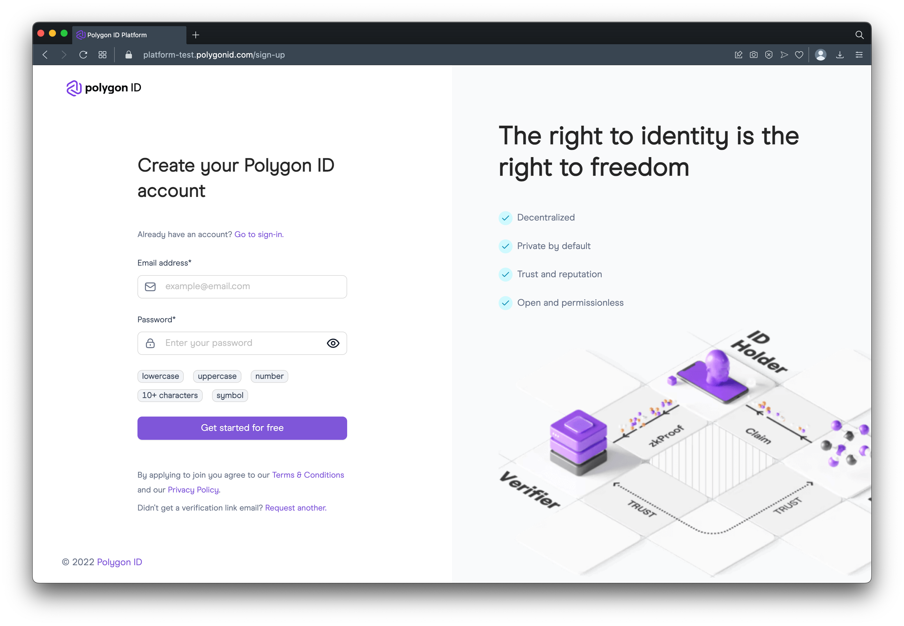
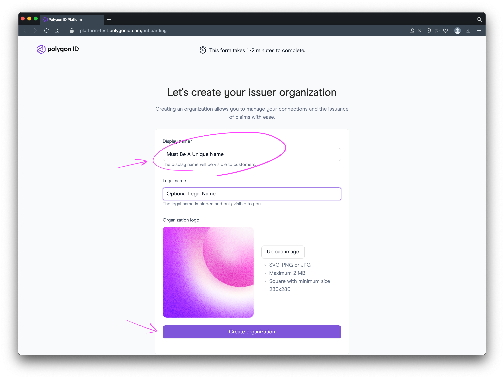
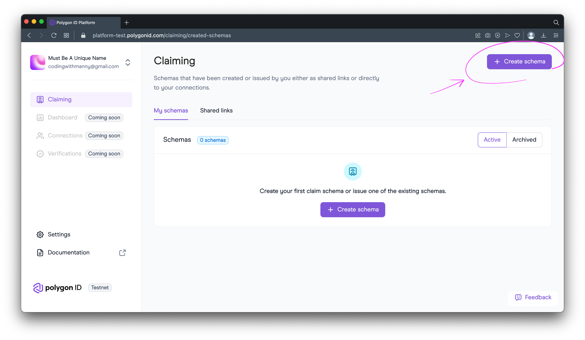
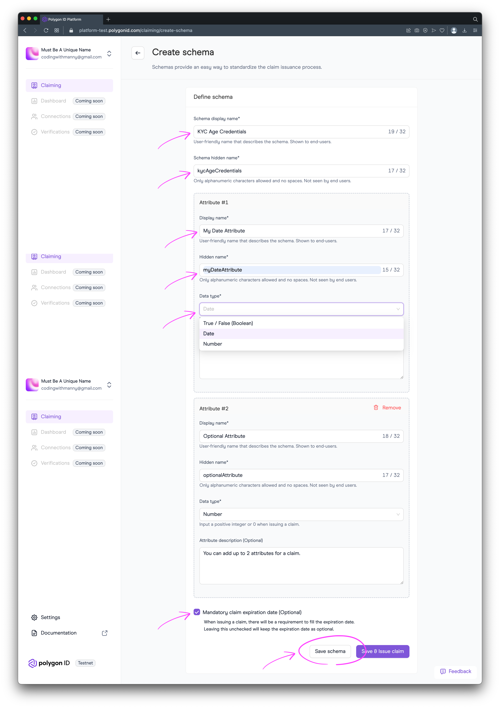

# Polygon On-Chain Verification

This demonstrates on-chain verification with Polygon ID and how perform verification with an erc20 contract that will only perform a mint if the person meets certain criteria.

**ℹ️ NOTE:** This is a [monorepo](https://semaphoreci.com/blog/what-is-monorepo) setup with [lerna](https://lerna.js.org) to help share environment variables between the frontend and the contract.


---

## Requirements

- NVM or Node `v18.12.1`
- Yarn `v1.22.19`
- Polygon ID Mobile App
    - [Polygon ID iOS](https://apps.apple.com/us/app/polygon-id/id1629870183)
    - [Polygon ID Android](https://play.google.com/store/apps/details?id=com.polygonid.wallet&gl=US)

---

## Concept

There are 3 entities in SSI (Self-Sovereign Identify) for the "Trust Triangle" (https://www.okta.com/identity-101/self-sovereign-identity/).

The concepts are also based on this book called [Self-Sovereign Identity: Decentralized digital identity and verifiable credentials](https://www.amazon.com/Self-Sovereign-Identity-Decentralized-verifiable-credentials/dp/1617296597)

1 - Owner

2 - Issuer

3 - Verifier

---

## Full Walkthrough

**ℹ️ NOTE:** Do this from the root of the repository and not the individual package directories.

### Step 1 - Install Dependencies


```bash
# FROM ./on-chain-verification

yarn install;
```

### Step 2 - Configure Environment Variables

**ℹ️ NOTE:** The `.env` file is found in the root of this tutorial example.

```bash
# FROM ./on-chain-verification

cp .env.example .env
```

The main env vars you'll need to add is:

```bash
WALLET_PRIVATE_KEY=<YOUR_WALLET_PRIVATE_KEY_DO_NOT_SHARE>
```

**File:** `.env`

```yaml
ETHERSCAN_API_KEY=<OPTIONAL_POLYGONSCAN_API_KEY>
RPC_MUMBAI_URL="https://rpc-mumbai.maticvigil.com"
WALLET_PRIVATE_KEY=<YOUR_WALLET_PRIVATE_KEY_DO_NOT_SHARE>
CONTRACT_ADDRESS=<YOUR_DEPLOYED_CONTRACT_ER20_OR_ERC721>
VALIDATOR_CONTRACT_ADDRESS=0xb1e86C4c687B85520eF4fd2a0d14e81970a15aFB

# hash name of function 'submitZKPResponse'
# How do I hash function names?
# - https://codingwithmanny.medium.com/how-to-hash-your-solidity-function-names-in-etherjs-d1597eaad26
METHOD_ID=b68967e2 
CHAIN_ID=80001
NETWORK="polygon-mumbai"

# For multiple use ; Ex: 123;456
ALLOWED_ISSUERS="*"
REQ_ATTRIBUTE="Date"
# 2 or 3 - Attribute 2 & 3 from the claim attributes in the issuer
REQ_SLOT_INDEX=2
# https://0xpolygonid.github.io/tutorials/verifier/verification-library/zk-query-language/
REQ_OPERATOR="$lt"
REQ_VALUE=20020101
SCHEMA_ID="<YOUR_SCHEMA_ID>"
SCHEMA_HASH="<YOUR_SCHEMA_HAS>"
SCHEMA_URL="<YOUR_SCHEMA_URL>"
SCHEMA_TYPE="<YOUR_SCHEMA_TYPE>"

# MUMBAI RPCS
# https://matic-testnet-archive-rpc.bwarelabs.com
# https://polygon-testnet.public.blastapi.io
# https://matic-mumbai.chainstacklabs.com
# https://rpc-mumbai.maticvigil.com
# https://polygon-mumbai.g.alchemy.com/v2/demo
# https://polygontestapi.terminet.io/rpc
```

### Step 3 - Deploy Contract

```bash
yarn compile;
# Runs
# ./node_modules/.bin/hardhat compile

yarn deploy;
# Runs
# ./node_modules/.bin/hardhat run ./scripts/deploy.ts --network mumbai

# Expected Output:
# ERC20zkAirdrop deployed to 0xyourContractAddress
# 
#  —————
# 
#  >  Lerna (powered by Nx)   Successfully ran target deploy for project on-chain-verification-contract (10s)
#  
# ✨  Done in 11.39s.
```

Copy `0xyourContractAddress` to your `.env` file:

**File:** `.env`

```yaml
CONTRACT_ADDRESS=0xyourContractAddress
```

### Step 4 - Create Claim

This will guide you through the steps of creating a claim and issuing it to your Polygon ID App on your mobile device.

**A - Issuer Sign Up**

This platform issuer is still a beta and is a work in progress.

Sign up for and account at [https://platform-test.polygonid.com/sign-up](https://platform-test.polygonid.com/sign-up).



**B - Create Issuer Organization**

In order to create an issuer you need to associate it an organization. Currently there is only one organization per email account sign-up.



**C - Create Claim Schema**

A schema allows you to define what kind of data structure and requirements should your claim adhered.



**D - Configure Claim Schema**

When creating a new claim schema you can define a `Schema Display Name` to better display to the user and the `Schema Hidden Name` to use for our proof request.

For attributes, we can add up to a maximum of 2 attributes of a `Boolean`, `Date`, or `Number`.

⚠️ Recommended: It's recommended to set your schema to create claims that have an expiration date.



WIP

- Set attribute name

- Copy schema ID

- Copy schema Hash

- Copy schame URL

**E - Configure Claim**

**F - Configure Claim Link**

**G - Connect & Accept Claim**

### Step 5 - Set ZKP Request

### Step 6 - Run Verifier Frontend

### Step 7 - Mint ERC20 Airdrop With Proof

---

## Debugging Errors

### Wrong Claim Schema Has Been Used For Proof Generation

### Wrong Query Operator Has Been Used For Proof Generation

### Wrong Comparison Value Has Been Used For Proof Generation

### Proof Can Not Be Submitted More Than Once
